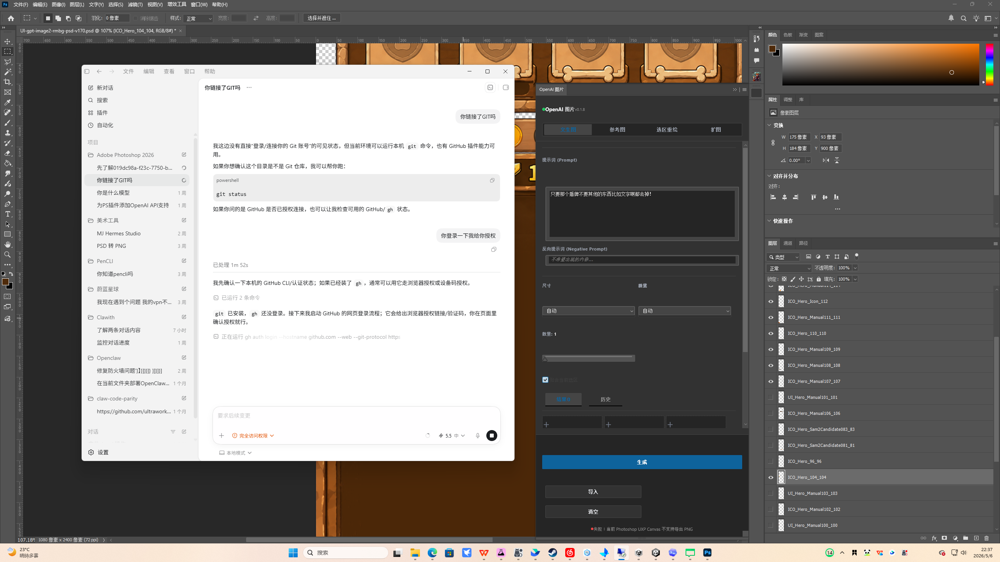

# OpenAI Photoshop Generator

OpenAI Photoshop Generator is an open-source Adobe Photoshop UXP plugin built with Codex-assisted development. It focuses on OpenAI image generation and editing workflows inside Photoshop, without carrying over the heavy Stable Diffusion / A1111 / ComfyUI parameter surface.

The plugin is designed for fast creative loops: generate a draft, use the current canvas as a reference, repaint a rectangular selection, extend canvas edges, preview results, and place selected outputs back into the active Photoshop document.



## Current Features

- Text-to-image generation through the OpenAI Image API.
- Reference-image editing by exporting the current Photoshop document and sending it to OpenAI edits.
- Rectangular-selection repainting with a generated same-size mask.
- Outpainting by adding top, bottom, left, and right margins before an edit request.
- Result preview inside the panel.
- Import generated results into the current Photoshop document as layers.
- Fit imported output to the active rectangular selection when appropriate.
- Local history for generated results.
- Configurable base URL, generation path, edit path, model, image size, quality, and output format.
- Chinese UI for the main workflow and status messages.

## OpenAI API Flow

The default official OpenAI configuration is:

```text
Base URL: https://api.openai.com/v1
Image generation: /images/generations
Image edits: /images/edits
Model: gpt-image-2
```

The plugin also supports local relay services that expose compatible image endpoints, for example:

```text
Base URL: http://127.0.0.1:49456/v1
Image generation: /images/generations
Image edits: /images/edits
```

`/chat/completions` is not a standard image endpoint. Use it only if your relay service intentionally maps chat requests to image base64 responses.

## Repository Layout

```text
.
├── manifest.json              # Adobe UXP manifest
├── index.html                 # Photoshop panel markup
├── src/app.js                 # Photoshop + OpenAI workflow logic
├── src/styles.css             # Panel styling
├── assets/                    # Plugin and panel icons
├── stitch-reference/          # UI references and smoke-test screenshots
├── docs/                      # Maintainer and application notes
└── .github/                   # Issue and pull request templates
```

## Install for Development

1. Install Adobe Creative Cloud and Adobe Photoshop.
2. Install Adobe UXP Developer Tool.
3. Clone this repository.
4. In UXP Developer Tool, choose `Add Plugin`.
5. Select this repository's `manifest.json`.
6. Choose Photoshop and click `Load`.

```powershell
git clone https://github.com/wuji419-bit/OpenAI-PS.git
cd OpenAI-PS
```

## Basic Usage

1. Open the plugin panel in Photoshop.
2. Open settings and enter your OpenAI API key.
3. Use the default official OpenAI image paths or configure a compatible local relay.
4. Choose one of the workflow modes: text-to-image, reference edit, selection repaint, or outpaint.
5. Enter a prompt and generate.
6. Preview results in the panel.
7. Import the selected result back into Photoshop.

See [`README_CN.md`](README_CN.md) for Chinese usage notes.

## Maintainer Notes

This project is a public open-source maintainer project. API credits, if granted, would be used for compatibility testing, release smoke tests, repeatable demo assets, issue reproduction, and OpenAI Image API migration work.

See:

- [`docs/openai-image-flow.md`](docs/openai-image-flow.md)
- [`docs/maintainer-plan.md`](docs/maintainer-plan.md)
- [`docs/codex-for-oss-application.md`](docs/codex-for-oss-application.md)
- [`ROADMAP.md`](ROADMAP.md)

## Contributing

Contributions are welcome. Start with [`CONTRIBUTING.md`](CONTRIBUTING.md), and include Photoshop version, OS, and manual test notes in pull requests.

## Security

Do not commit API keys, private PSD files, generated client assets, or local plugin storage. See [`SECURITY.md`](SECURITY.md).

## License

MIT License. See [`LICENSE`](LICENSE).
