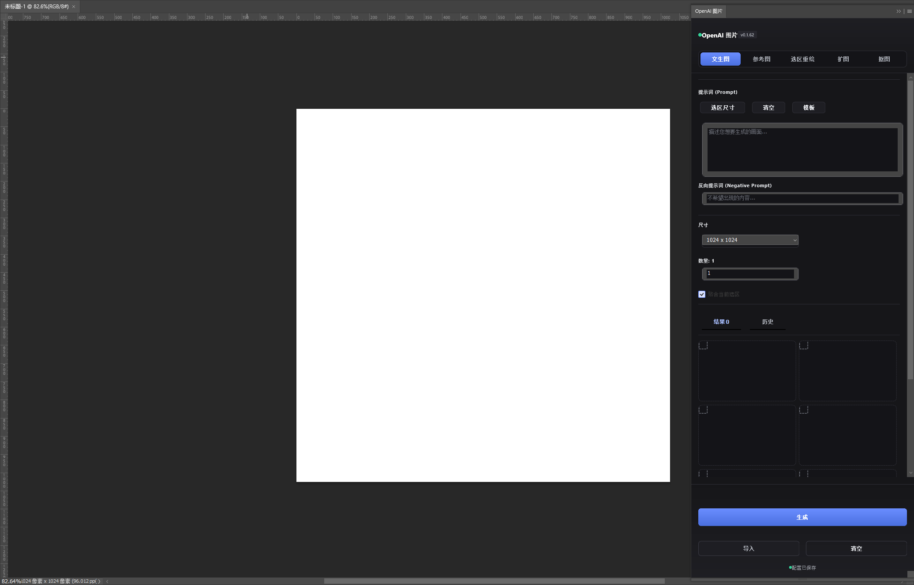

# OpenAI Photoshop Generator

Current version: **v0.1.313**



OpenAI Photoshop Generator is an open-source Adobe Photoshop UXP plugin built with Codex-assisted development. It focuses on OpenAI image generation and editing workflows inside Photoshop, including text-to-image, manual reference-image editing, Photoshop selection repainting, outpainting, and native-transparent PNG workflows, without carrying over the heavy Stable Diffusion / A1111 / ComfyUI parameter surface.

The plugin is designed for fast creative loops: generate a draft, use the current canvas as a reference, repaint a rectangular selection, extend canvas edges, generate native-transparent PNG layers, preview results, and place selected outputs back into the active Photoshop document.

## Current Features

- Text-to-image generation through the OpenAI Image API.
- Reference-image editing by selecting a local PNG/JPG/WebP in the panel, falling back to the current Photoshop selection or canvas when no manual reference is selected.
- Rectangular-selection repainting from an Alpha-preserving screenshot reference, with no API mask and pixel-exact RGBA placement back into the original selection.
- Outpainting by adding top, bottom, left, and right margins before an edit request.
- Result preview inside the panel.
- Import generated results into the current Photoshop document as layers.
- Fit imported output to the active rectangular selection when appropriate.
- Local history for generated results.
- Configurable base URL, generation path, edit path, model, image size, quality, and output format.
- Chinese UI for the main workflow and status messages.

## OpenAI API Flow

Configure OpenAI-compatible endpoints and model IDs supported by your provider:

```text
Base URL: https://api.openai.com/v1
Image generation: /images/generations
Image edits: /images/edits
Model: gpt-image-2.5-flare (Fast) / gpt-image-2.5-sunburst (Deep) / gpt-image-2 (legacy)
```

The plugin also supports local relay services that expose compatible image endpoints, for example:

```text
Base URL: http://127.0.0.1:49456/v1
Image generation: /images/generations
Image edits: /images/edits
```

`/chat/completions` is not a standard image endpoint. Use it only if your relay service intentionally maps chat requests to image base64 responses.

## Native Transparency and Selection Replacement

Photoshop 25.0 or newer is required. Fast/Deep image model IDs are provider-dependent; keep the configured OpenAI-compatible route and select a model exposed by that provider.

Selection repaint preserves Alpha throughout screenshot export, tiny-selection resizing, result normalization, and import. It writes pixels at the captured selection origin instead of scaling a smart object's visible bounds. For translucent replacements, original layers are retained inside a pass-through source group with a new outside-selection mask; the generated pixel layer sits above that group. This suppresses deleted source content without flattening or erasing original layers or their existing masks. Background layers are preserved hidden with a normal duplicate inside the group. Import is a single undoable transaction; errors and cancellation roll it back.

Run `npm run smoke` for the regular plugin smoke and strict native-transparency regressions, or `npm run test:alpha` for the latter alone. These tests do not use paid APIs. A stopped Photoshop process is reported by the runtime audit as `not-running`, not as a verified loaded panel.

The active plugin no longer invokes Koukoutu or ComfyUI. Historical cutout results remain importable. Legacy workflow descriptors and setup notes are retained in the repository as reference material only.

## Repository Layout

```text
.
├── manifest.json              # Adobe UXP manifest
├── index.html                 # Photoshop panel markup
├── src/app.js                 # Photoshop + OpenAI workflow logic
├── src/styles.css             # Panel styling
├── assets/                    # Plugin and panel icons
├── comfyui-workflows/         # ComfyUI API workflow JSON files
├── comfyui-remote-setup/      # Remote AI-machine setup helper notes/scripts
├── stitch-reference/          # UI references and smoke-test screenshots
├── docs/                      # Maintainer and application notes
└── .github/                   # Issue and pull request templates
```

## Install for Development

1. Install Adobe Creative Cloud and Adobe Photoshop.
2. Install Adobe UXP Developer Tool.
3. Clone this repository.
4. In UXP Developer Tool, choose `Add Plugin`.
5. Select this repository's `manifest.json`.
6. Choose Photoshop and click `Load`.

```powershell
git clone https://github.com/wuji419-bit/OpenAI-PS.git
cd OpenAI-PS
```

## Windows Installer

For non-technical Windows users, build a self-contained installer:

```powershell
npm run build:windows-installer
```

The generated file is written to `dist/OpenAI-PS-Installer-<version>-win-x64.exe`. It installs the UXP plugin into `%APPDATA%\Adobe\UXP\Plugins\External\com.local.openai.photoshop.generator` and updates `%APPDATA%\Adobe\UXP\PluginsInfo\v1\PS.json`. The installer is unsigned, so Windows SmartScreen may require “More info” > “Run anyway”.

## Basic Usage

1. Open the plugin panel in Photoshop.
2. Open settings and enter your OpenAI API key.
3. Use the default official OpenAI image paths or configure a compatible local relay.
4. Choose one of the workflow modes: text-to-image, manual reference-image edit, selection repaint, outpaint, or cutout.
5. Enter a prompt and generate.
6. Preview results in the panel.
7. Import the selected result back into Photoshop.

See [`README_CN.md`](README_CN.md) for Chinese usage notes.

## Maintainer Notes

This project is a public open-source maintainer project. API credits, if granted, would be used for compatibility testing, release smoke tests, repeatable demo assets, issue reproduction, and OpenAI Image API migration work.

See:

- [`docs/openai-image-flow.md`](docs/openai-image-flow.md)
- [`docs/maintainer-plan.md`](docs/maintainer-plan.md)
- [`docs/codex-for-oss-application.md`](docs/codex-for-oss-application.md)
- [`ROADMAP.md`](ROADMAP.md)

## Contributing

Contributions are welcome. Start with [`CONTRIBUTING.md`](CONTRIBUTING.md), and include Photoshop version, OS, and manual test notes in pull requests.

## Security

Do not commit API keys, private PSD files, generated client assets, or local plugin storage. See [`SECURITY.md`](SECURITY.md).

## License

MIT License. See [`LICENSE`](LICENSE).
